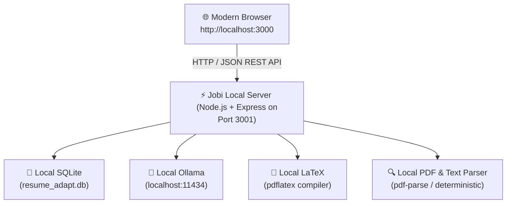

# Jobi — Local-First AI Resume Adapter

<p align="center">
  
</p>

<p align="center">
  <b>Tailor your authentic master resume for every dream job using air-gapped local AI and mathematical LaTeX typography.</b><br>
  <i>100% on-device • Zero cloud AI • Zero paid API tokens • Zero data leaks</i>
</p>

---

## 🎯 What is Jobi?

Jobi is a **local-first web application** that transforms an authentic master resume into tailored, role-aligned editions with pure mathematical LaTeX typography. Unlike cloud resume builders that upload sensitive personal information and charge for API tokens, Jobi runs **entirely on your local machine**:

- **Protected Master Base**: Your core career profile remains the immutable source of truth in a local SQLite database.
- **Job-Specific Adaptations**: Create tailored versions for specific job descriptions without altering your master source.
- **Air-Gapped AI Inference**: Powered by local LLMs via [Ollama](https://ollama.ai) (e.g. `llama3.1`, `qwen2.5`, `mistral`).
- **100% Functionality Without AI**: If Ollama isn't running, Jobi automatically uses deterministic heuristics for keyword extraction, ATS scoring, and bullet optimization.
- **Local LaTeX Sandbox**: Compile real PDFs directly on your machine with safe, sandboxed `pdflatex` execution.

---

## 🏗️ Architecture



---

## 🚀 Quickstart (Under 2 Minutes)

```bash
# 1. Clone the repository
git clone https://github.com/iamnih4l/JOBI.git
cd JOBI

# 2. Run initial setup (installs frontend & backend dependencies)
npm run setup

# 3. Verify your environment
npm run doctor

# 4. Start the application
npm run dev
```

Now open **[http://localhost:3000](http://localhost:3000)** in your browser!

---

## 🩺 Diagnostics (`npm run doctor`)

Jobi includes an environment doctor to verify your setup:

```bash
npm run doctor
```

Example output:
```
============================================================
       🩺 JOBI ENVIRONMENT & ARCHITECTURE DOCTOR           
============================================================

  ✓ Node.js: v23.0.0 (Supported)
  ✓ Architecture: Local-First Web Application (Desktop wrapper removed)
  ✓ SQLite Persistence: READY (Engine: node:sqlite)
  ⚠ LaTeX Compiler: NOT DETECTED (pdflatex not on PATH)
    -> Optional: Install MiKTeX (Windows: https://miktex.org) or TeX Live.
    -> Jobi works without it using live LaTeX and HTML paper preview.
  ✓ Local AI (Ollama): CONNECTED at http://127.0.0.1:11434
    Models detected: llama3.1:latest

------------------------------------------------------------
  🚀 STATUS: READY FOR LOCAL RUN
  Run: npm run dev
  Open: http://localhost:3000
============================================================
```

---

## 🤖 Local AI Setup (Ollama)

Jobi uses **Ollama** for air-gapped on-device bullet rewriting. **No API keys or paid accounts are required.**

1. **Download & Install Ollama**:
   - Visit [https://ollama.ai](https://ollama.ai) and install for Windows, macOS, or Linux.
2. **Download a Model**:
   ```bash
   # Recommended for fast, high-quality adaptations:
   ollama run llama3.1
   ```
3. **Verify Ollama is Running**:
   Ollama automatically listens at `http://127.0.0.1:11434`. Jobi will automatically detect it in the Diagnostics screen.

> [!NOTE]
> If Ollama is offline or not installed, Jobi automatically uses its deterministic heuristic engine. All features (importing, editing, ATS keyword matching, compiling, downloading) work 100% offline without AI.

---

## 📄 Local LaTeX Setup (Optional for PDF Compilation)

Jobi includes an interactive physical paper preview that works out-of-the-box in the browser. To compile real, publication-grade vector `.pdf` files locally using `pdflatex`:

- **Windows**: Install [MiKTeX](https://miktex.org/download) or [TeX Live](https://www.tug.org/texlive/). Ensure `pdflatex` is added to your system `PATH`.
- **macOS**: Install MacTeX:
  ```bash
  brew install --cask mactex
  ```
- **Linux (Ubuntu/Debian)**:
  ```bash
  sudo apt-get update && sudo apt-get install texlive-latex-base texlive-latex-extra
  ```

---

## 🔒 Privacy Boundary & Security

1. **Air-Gapped Guarantee**: Jobi makes zero external network calls to cloud LLM providers, telemetry endpoints, or cloud databases.
2. **Local Persistence**: All resumes, job targets, and version histories are stored in your local SQLite database (`resume-adapt/resume_adapt.db`).
3. **Sandboxed Subprocesses**: LaTeX compilation runs in isolated temporary directories with strict timeouts and path traversal sanitization.
4. **No Mandatory Accounts**: No login, passwords, email verification, or third-party auth required.

---

## 🛠️ Development & Available Scripts

From the root project directory:

| Command | Description |
| :--- | :--- |
| `npm run setup` | Installs root, client, and server dependencies |
| `npm run dev` | Runs Express server (port 3001) and Vite dev server (port 3000) concurrently |
| `npm run doctor` | Performs diagnostic health check on Node, SQLite, Ollama, and LaTeX |
| `npm run build` | Builds client production bundle into `resume-adapt/dist` |
| `npm run server` | Runs the Express local backend server standalone |

---

## 🤝 Contributing

Contributions from students and open-source developers are warmly welcome!

1. Fork the repository.
2. Create a feature branch: `git checkout -b feature/my-feature`.
3. Verify your changes pass `npm run doctor` and `npm run build`.
4. Commit your changes: `git commit -m "Add feature"`.
5. Open a Pull Request.

---

## 📄 License

MIT License — free for personal, educational, and commercial use.

